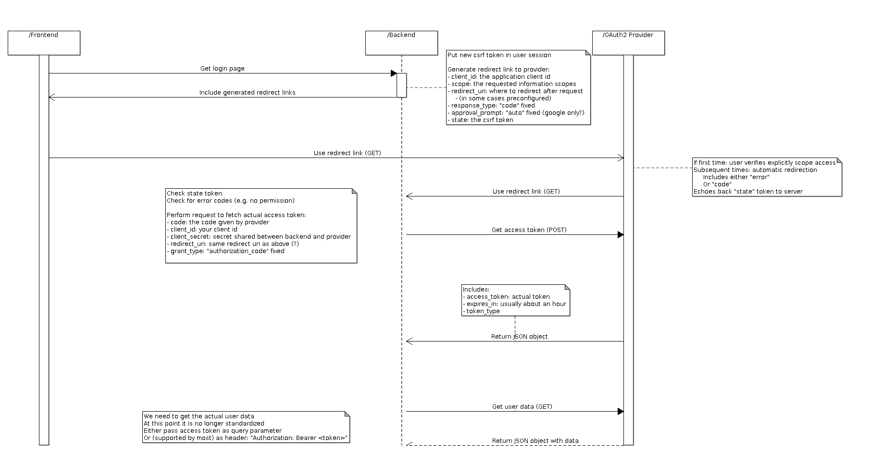

# OAuth2 Provider

The sequence flow for oauth2 authentication is as follows:

There are a couple of things that need to happen: 

1) Generating a redirect link and updating the user session with the csrf token. This can be done with the service `nabu.authentication.OAuth2.getRedirectLink`
2) Register a listener that will catch the incoming redirect and transform the "code" to a "token", this can be done by creating a new artifact of the type `OAuth2 Provider`. Here you have to fill in the details for the specific provider:

- **clientId**: public key for your application (gotten from provider)
- **clientSecret**: a shared secret between you and the provider (never sent to frontend)
- **scopes**: the scopes you are interested in requesting later on, they need to be included in the original request
- **loginEndpoint**: the endpoint where the initial redirect occurs
- **tokenEndpoint**: the endpoint where the token can be resolved from the code
- **apiEndpoint**: currently unused, it is where the token can be used to get information
- **httpClient**: the client you want to use to perform the request
- **webArtifact**: the artifact where the listener should be added to
- **serverPath**: the path of the listener
- **errorPath**: if something goes wrong (e.g. the provider sends back an error), we need to redirect to a page where the error can be displayed to the user
- **successPath**: if everything is ok, we need to redirect to a page that makes it clear everything was successful (e.g. the home page)
- **authenticatorService**: the custom service that can translate the token provided by the external provider to an internal token that can be used to identify the user
- **requireStateToken**: if set to "true", the state _must_ be used, otherwise the state is only used if there is a session available and on incoming redirects if it exists in the URL
3) Create a service that can map the external provider token to an internal token, to do that you need to call a rest service which is most easily accomplished by using a new `REST Client` artifact. 

## Google

For `google` this boils down to:

OAuth2 Artifact:
- scopes: email, profile (if you are only interested in these)
- loginEndpoint: https://accounts.google.com/o/oauth2/auth
- tokenEndpoint: https://www.googleapis.com/oauth2/v3/token
- apiEndpoint: https://www.googleapis.com/oauth2/v1/userinfo?alt=json

REST Client artifact:

- **method**: GET
- **path**: /oauth2/v1/userinfo
- **requestHeaders**: authorization. We use this to send "Authorization: Bearer <token>"
- **host**: www.googleapis.com
- **secure**: true
- **requestType**: JSON
- **output**: for the scopes "email" and "profile", a document that contains:
	- **id**: a google id
	- **email**: the email address for the user
	- **verified_email**: whether or not the user was verified
	- **name**: the (nick?) name for the user
	- **given_name**: first name
	- **family_name**: last name
	- **link**: a google plus link to the profile
	- **picture**: an avatar for the user
	- **gender**: e.g. male
	- **locale**: something like "nl"
